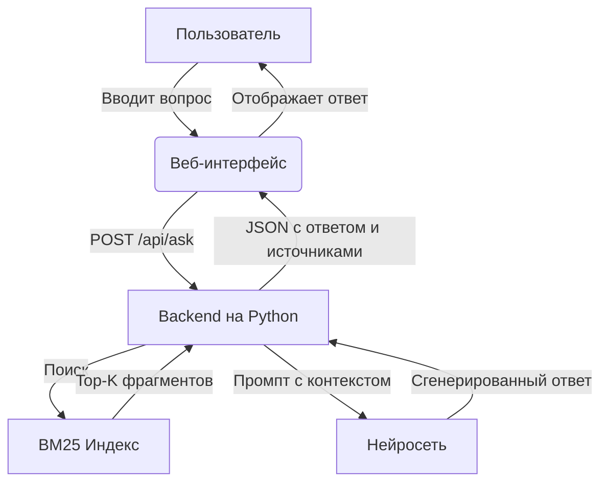

# Архитектура ShukBot

## Общая схема
## Общая схема

## Компоненты

### 1. Frontend

- Статическая HTML-страница с полем ввода, кнопкой и блоком результата.
- JavaScript отправляет POST-запрос на `/api/ask` с телом `{ "question": "..." }`.
- Получает JSON-ответ и отображает его.

### 2. Backend (API)

- Принимает вопрос.
- Вызывает модуль поиска (BM25) для получения Top-K фрагментов.
- Формирует промпт: системная инструкция + вопрос + найденные фрагменты.
- Отправляет промпт в нейросеть через API.
- Возвращает ответ и список источников.

**Эндпоинт:**

| Метод | Путь | Описание |
|-------|------|----------|
| POST | `/api/ask` | Принимает вопрос, возвращает ответ |
| GET | `/api/health` | Проверка работоспособности |

### 3. Поисковый модуль (BM25)

- Хранит индекс документов (например, SQLite FTS5 или библиотека `rank_bm25`).
- По запросу возвращает N наиболее релевантных фрагментов.
- Работает локально, без внешних сервисов.

### 4. Нейросеть (LLM)

- Внешний API (например, OpenAI, Groq, Ollama).
- Получает промпт с явной инструкцией: «Отвечай только на основе предоставленных фрагментов».
- Возвращает текст ответа.

## Поток данных

1. Пользователь вводит вопрос.
2. Frontend → Backend: `POST /api/ask`.
3. Backend → BM25: поиск по индексу.
4. BM25 → Backend: список фрагментов.
5. Backend → LLM: промпт с вопросом и фрагментами.
6. LLM → Backend: ответ.
7. Backend → Frontend: JSON `{ answer, sources }`.
8. Frontend отображает ответ.

## Технологии (предварительно)

| Слой | Технология |
|------|-----------|
| Frontend | HTML, CSS, JavaScript (без фреймворков на старте) |
| Backend | Python 3.11+, FastAPI |
| Поиск | `rank_bm25` или SQLite FTS5 |
| Нейросеть | API (OpenAI / Groq / Ollama) |
| Хранение | Файловая система + SQLite для индекса |
