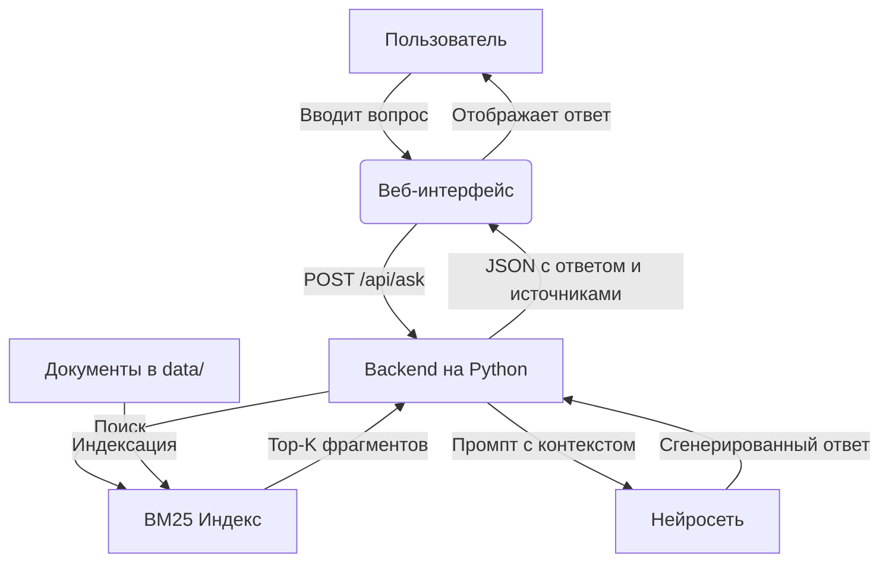

# Архитектура ShukBot

## Общая схема



## Компоненты

### 1. Frontend

- Статическая HTML-страница с полем ввода, кнопкой и блоком результата.
- JavaScript отправляет POST-запрос на `/api/ask` с телом `{ "question": "..." }`.
- Получает JSON-ответ и отображает его.

### 2. Backend (API)

- Принимает вопрос.
- Вызывает модуль поиска (BM25) для получения Top-K фрагментов.
- Формирует промпт: системная инструкция + вопрос + найденные фрагменты.
- Отправляет промпт в нейросеть через API.
- Возвращает ответ и список источников.

**Эндпоинты:**

| Метод | Путь | Описание |
|-------|------|----------|
| POST | `/api/ask` | Принимает вопрос, возвращает ответ |
| GET | `/api/health` | Проверка работоспособности |

**Запрос `POST /api/ask`:**

```json
{ "question": "Что такое АСОИУ?" }
```

**Ответ:**

```json
{
  "answer": "АСОИУ — это ...",
  "found": true,
  "sources": [
    { "document": "Лекция_1_Введение_в_АСОИУ.pdf", "page": 12 }
  ]
}
```

Если подходящих фрагментов нет, нейросеть не вызывается: `found` = `false`, `sources` пустой, `answer` содержит сообщение об отсутствии информации.

**Ошибки:**

| Код | Когда |
|-----|-------|
| 400 | Пустой вопрос |
| 503 | Нейросеть недоступна |

### 3. Поисковый модуль (BM25)

- Собственная реализация BM25 на Python, без готовых поисковых библиотек (подробно — в [rag.md](rag.md)).
- Хранит обратный индекс по фрагментам документов.
- По запросу возвращает Top-K наиболее релевантных фрагментов.
- Работает локально, без внешних сервисов.

### 4. Индексация

- Отдельная команда (CLI), которая читает документы из `data/`, разбивает их на фрагменты и строит индекс.
- Запускается вручную при добавлении документов. Загрузка через веб-интерфейс в MVP не предусмотрена.

### 5. Нейросеть (LLM)

- Внешний API (например, OpenAI, Groq, Ollama).
- Получает промпт с явной инструкцией: «Отвечай только на основе предоставленных фрагментов».
- Возвращает текст ответа.

## Поток данных

1. Пользователь вводит вопрос.
2. Frontend → Backend: `POST /api/ask`.
3. Backend → BM25: поиск по индексу.
4. BM25 → Backend: список фрагментов.
5. Backend → LLM: промпт с вопросом и фрагментами.
6. LLM → Backend: ответ.
7. Backend → Frontend: JSON `{ answer, found, sources }`.
8. Frontend отображает ответ.

## Технологии (предварительно)

| Слой | Технология |
|------|-----------|
| Frontend | HTML, CSS, JavaScript (без фреймворков на старте) |
| Backend | Python 3.11+, FastAPI |
| Поиск | Собственная реализация BM25, лемматизация `pymorphy3` |
| Нейросеть | API (OpenAI / Groq / Ollama) |
| Хранение | Документы и файл индекса в `data/` |
